# Procter & Gamble 🔗

## Hosted link to our website 
To explore our project, visit here [https://sheetalgithub30.github.io/P-G/]()

## 📌 WEBSITE UI 

## 1. COMMUNITY IMPACT UI

 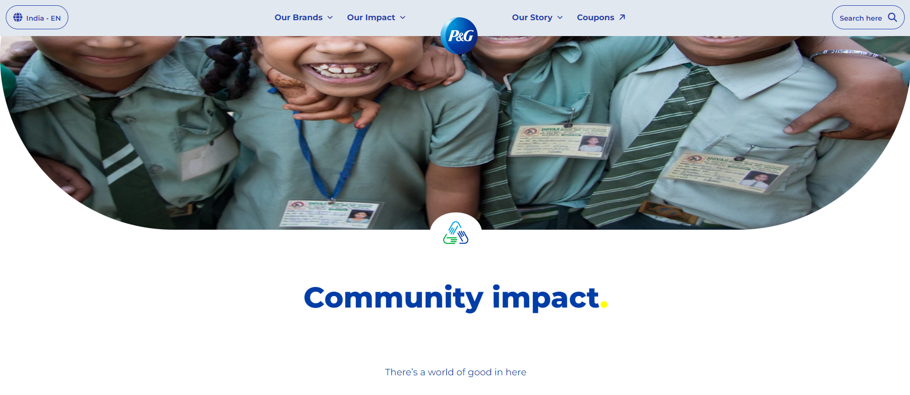
 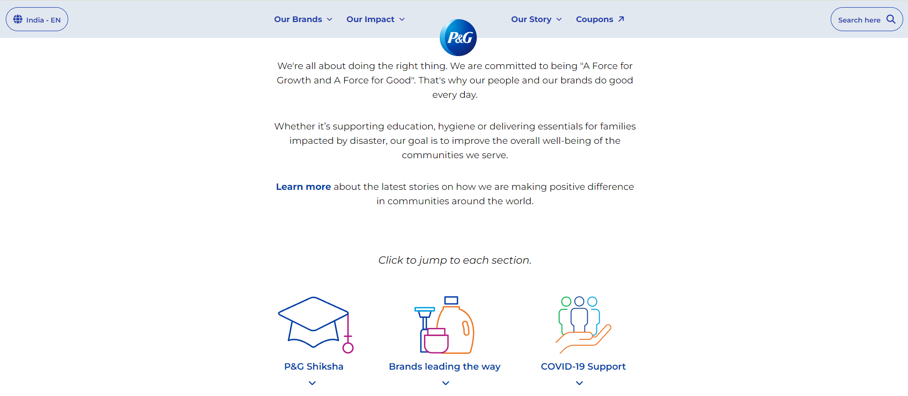
 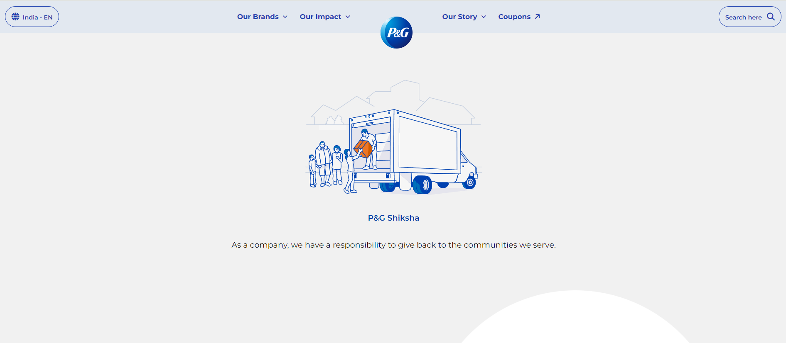
 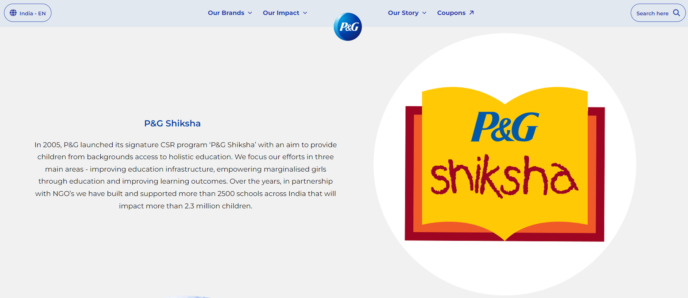
 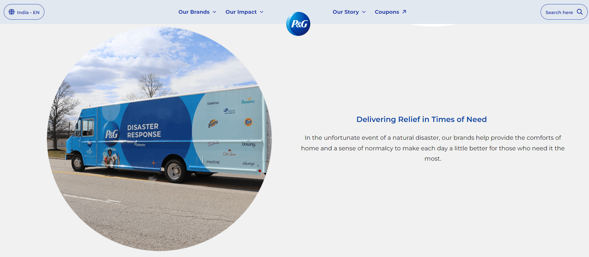
 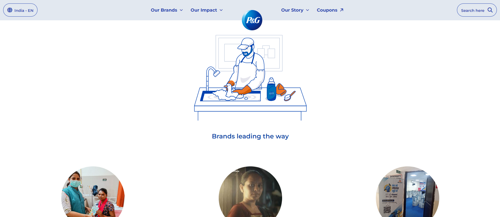
 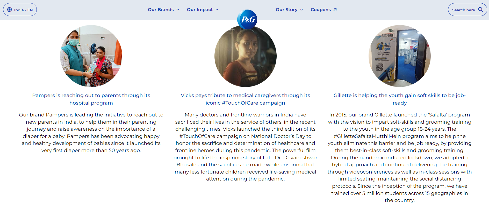
 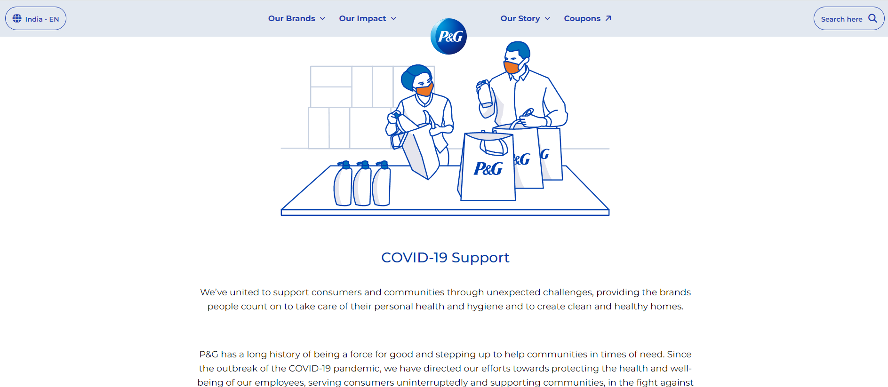
 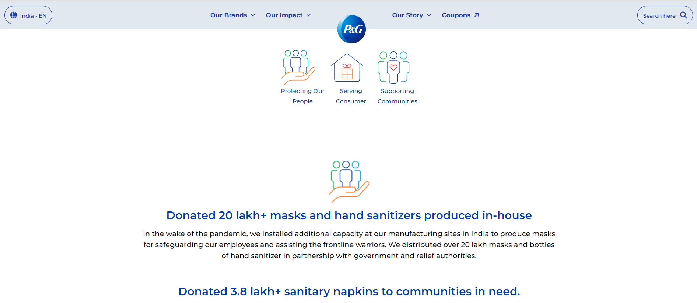
 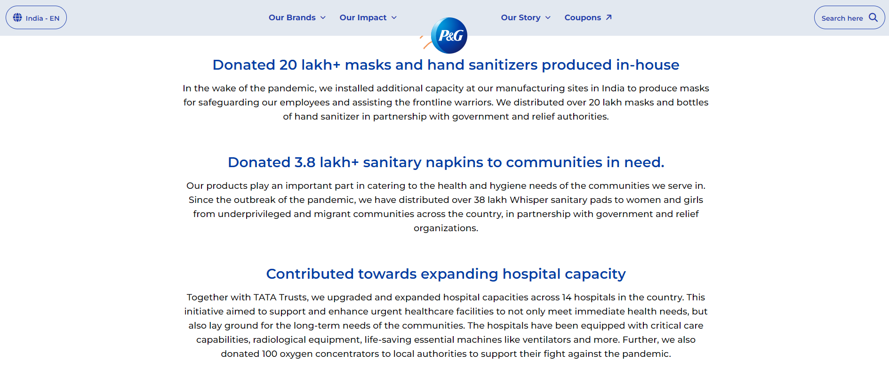
 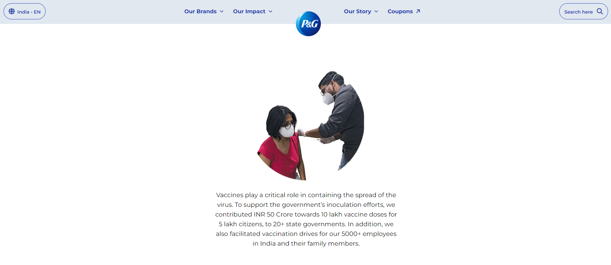
 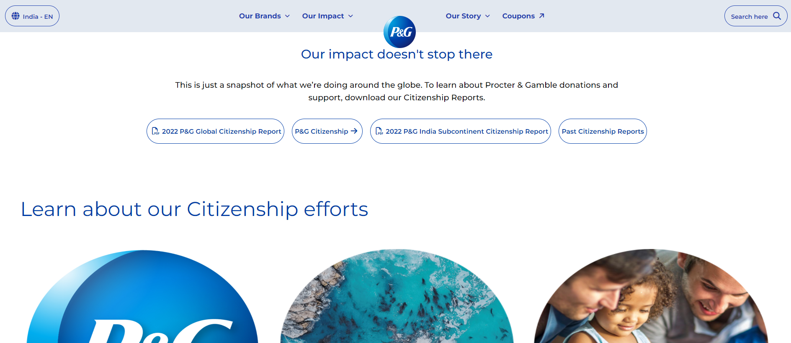
 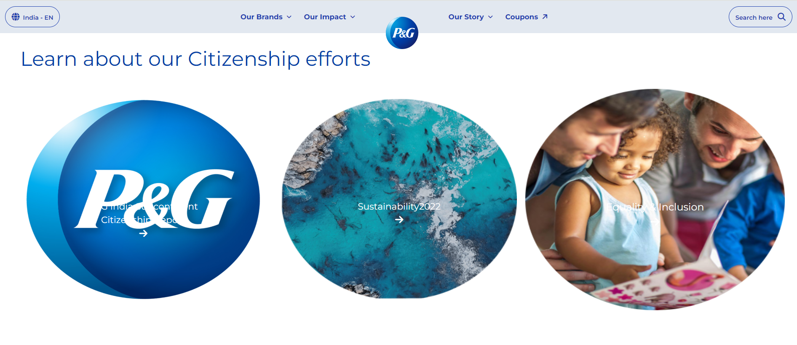
 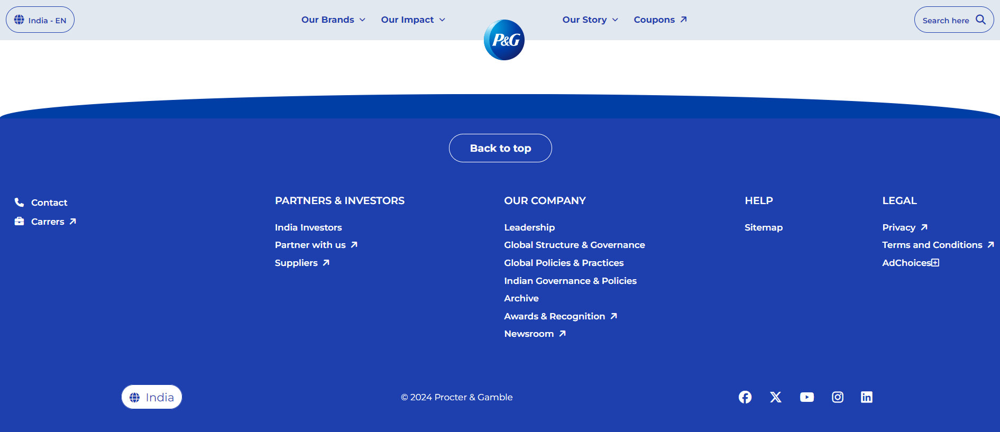

##### UI Description:<i> "The Community impact page is designed such that help users to easily access. The UI focuses on user-friendly navigation, allowing users to easily access services."</i>

## 2. INGREDIENTS
 
 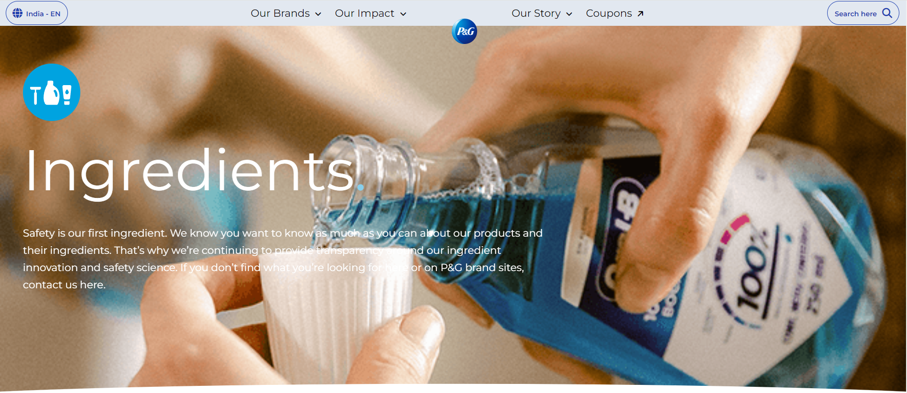
 
 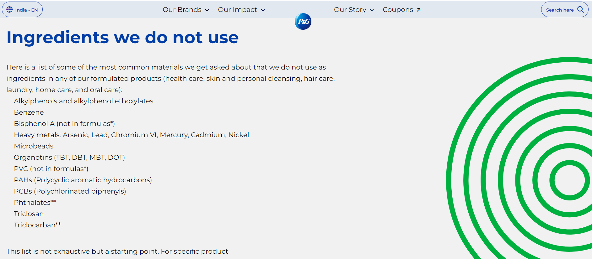
 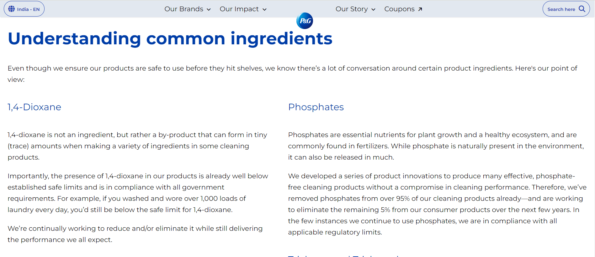
 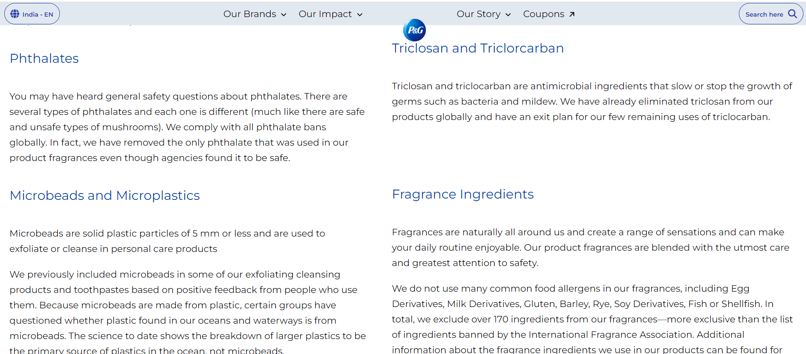
 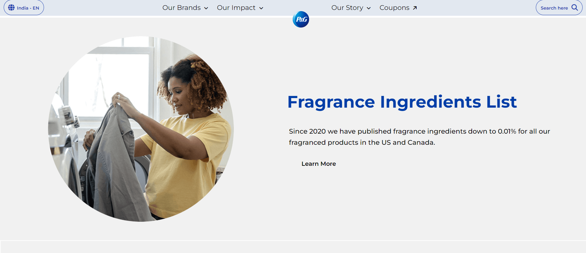
 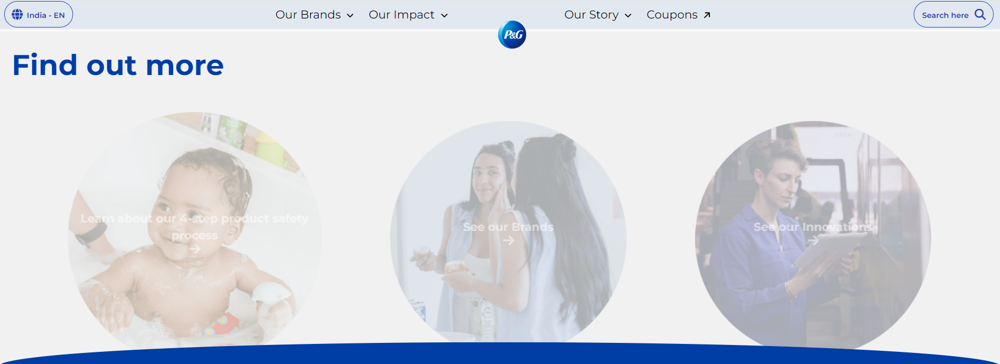
 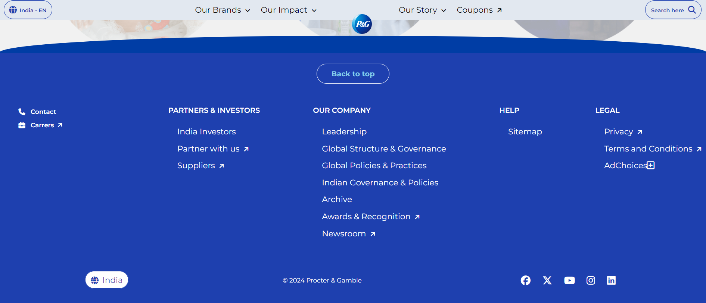
 

##### UI Description:<i> "The Ingredients page is designed such that help users to easily access. The UI focuses on user-friendly navigation, allowing users to easily access services."</i>

## 3. COUPONS

 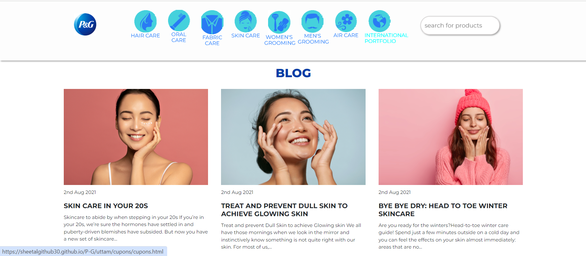
 
 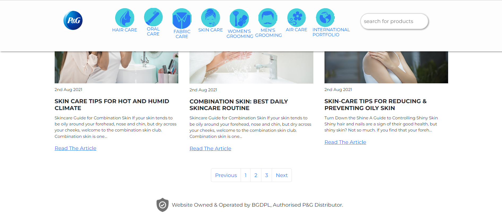
 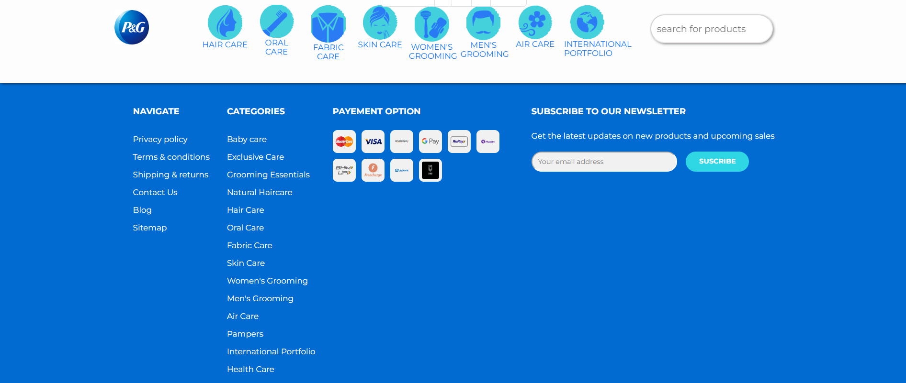

##### UI Description:<i> "The Coupons page is designed such that help users to easily access. The UI focuses on user-friendly navigation, allowing users to easily access services."</i>